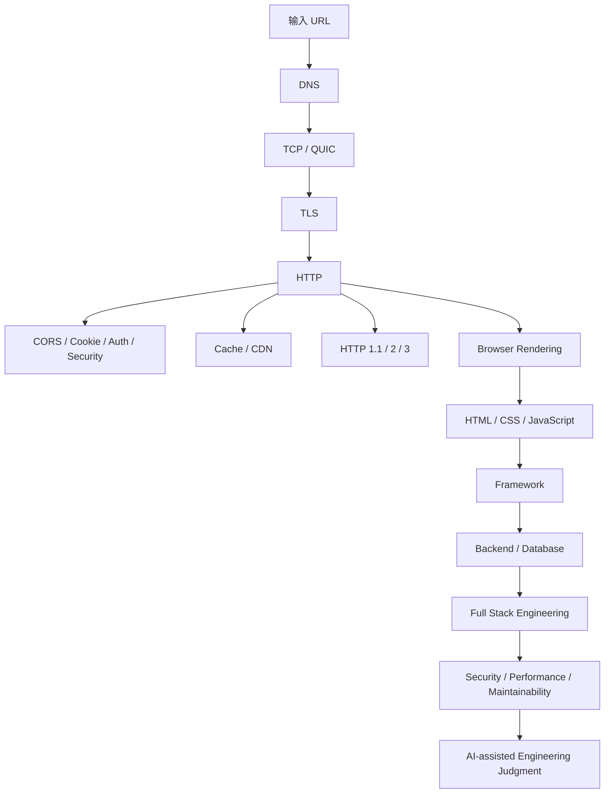

---
tags:
  - learning
  - moc
status: active
updated: 2026-08-08
---

# Learning Home

> 这是整个 Vault 的入口。每次开始新的学习会话，先看 [[02-Current/current-focus]] 和 [[02-Current/learning-context]]。

## 当前状态

**当前主线：Web / 网络 / 浏览器基础 → 前端基础 → 全栈基础 → 算法与工程能力。**

当前正在从一次真实前端/全栈面试暴露出的基础缺口出发，补齐“能解释、能判断、能追问”的基础，而不是只背结论。

- 当前主题：[[03-Knowledge/Web/04-browser-rendering]]
- 最近完成：[[03-Knowledge/Web/01-url-dns-tcp-tls-http]]、[[03-Knowledge/Web/02-cors-auth-security]]、[[03-Knowledge/Web/03-cache-cdn-http-versions]]
- 面试来源：[[04-Interviews/2026-08-07-bytedance-finance-insurance]]
- 总路线：[[01-Roadmap/learning-roadmap]]
- 掌握度：[[05-Progress/learning-status]]

## 知识地图

## 使用原则

学习笔记不追求一次写成教材，而记录三件事：**主干理解、容易说错的细节、面试时怎样准确表达**。

每学完一块，应同步更新：

1. 对应 `03-Knowledge/` 笔记；
2. [[05-Progress/learning-status]] 的掌握状态；
3. [[02-Current/current-focus]] 的下一步；
4. 如果来自真实面试，再回链到对应 `04-Interviews/` 复盘。
